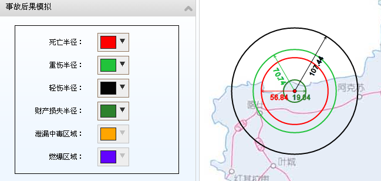
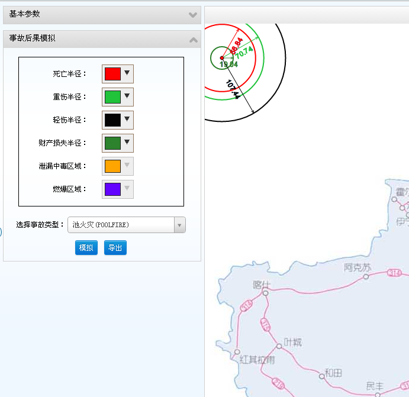

raphaelLineMark
===============

Draw a filledCircle as the center, and the center point is draggable on the paper;Then we draw four concentric circles.Sometimes it necessary to show the important info on the circles.How to show the info in correct position when you drag the center point to anywhere on the paper is the main Theme of this repository. 
Just Like this:
 

 
and if we change the position of the center point, the marks will show like this:
 

